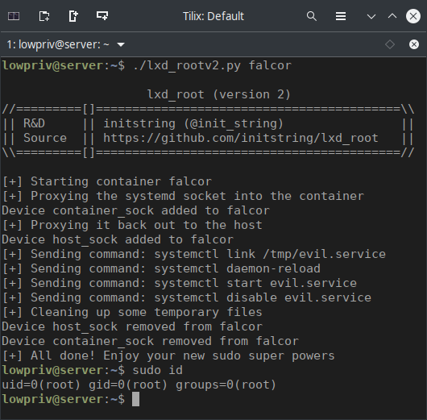

# Linux Privilege Escalation via LXD

## Overview
Members of the local `lxd` group on Linux systems have numerous routes to escalate their privileges to root. This repository contains examples of fully automated local root exploits. A detailed explanation of the vulnerability and an exploit walk-through is available in my blog [here](https://initblog.com/2019/lxd-root).

The exploits below are not container break-outs, but local root exploits that *leverage* containers and *target* the host OS. Low-privilege access to the host environment is required for successful exploitation.

I believe my strategy with version 2 of the exploit is unique, and was interesting enough (to me at least) to write a detailed explanation in the blog linked above.

- `lxd_rootv1.sh` mounts the host `/` filesystem into a container, where the host's low-privilege user has root access. This root access maps back to the host, allowing the current user to be added to the /etc/sudoers file. This has been exploited by others before me.
- `lxd_rootv2.py` mounts the host's systemd private UNIX socket into a container and then back to the host again via LXD proxy devices. These proxy devices have root privileges, and they pass *their* credentials during socket communications, as opposed to the credentials of the initiating low-privilege user. This is abused to create a temporary systemd service that adds the current user to the /etc/sudoers file.

## Usage
Both exploits require a container, so make one first. Then, run the exploit from the host OS with the name of the container as the first argument.

```
# Exploit with v1
$ bash lxd_rootv1.sh <container name>

# Exploit with v2
$ python3 lxd_rootv2.py <container name>
```



## Package Maintainter Response
Before I came across these issues, nothing in the official LXD documentation existed to warn users that the `lxd` group was dangerous. Anyone following the official guidelines to configure LXD would have added their account into this group before deploying their first container. I opened a bug with Canonical to express my concerns - you can read the full thread [here](https://bugs.launchpad.net/ubuntu/+source/lxd/+bug/1829071). The LXD team quickly made adjustments to the documentation, which now clearly states that this group should only be given to those trusted with root access.

As always, interacting with the Canonical folks via their bug tracker was a really pleasant experience. I'd like to thank them for their time and for the thoughtful consideration they gave my ideas. I highly recommend other security researchers bring items directly to them in this manner.

## Credits
I am not the first person to exploit LXD. This has been raised as a concern in several GitHub tickets dating back to 2016:
- https://github.com/lxc/lxd/issues/2003
- https://github.com/lxc/lxd/issues/3844

That first link is the first person (simpoir) to identify this risk, as far as I can tell.

[@reboare](https://twitter.com/reboare) wrote a nice blog about exploiting LXD using the same method as my v1 exploit, way before I did:
- https://reboare.github.io/lxd/lxd-escape.html

Thank you to the LXD folks for making a very cool tool. I personally use LXD and really like it. I don't think this is a deal-breaker in terms of using LXD, I think it is just very important to understand the potential risk when adding users to the `lxd` group.

## Remediation
There is no official fix for either of these vulnerabilities. Anyone using LXD should be aware that adding users to the `lxd` group is essentially turning them into root.

If you are using LXD on a single-user host, like a desktop, it may be best to simply not use the `lxd` group at all and to run `sudo` when you need to talk to the API.

For shared environments with multiple folks working on containers, it may be best to create nested environments. Each individual user of the LXD group will be able to exploit their own environment but will then have to work harder to break out of that container to exploit the others.
